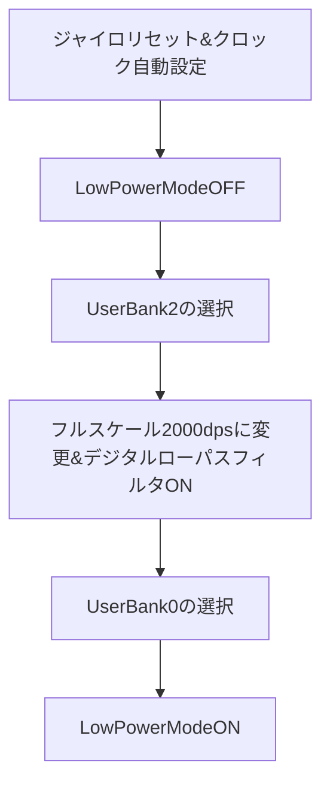

# サンプルコードを分析(仮)
## TODO 2020/01/04

- [x] ジャイロセンサ値の実機出力確認⇒問題なさそう。ただ要ゲイン調整
- [ ] 直進距離の適合

## RX631性能
ここではRX631(R5F5631MDDFL)の性能を記述する。
- マイコン概要

項目 | 数値
---|---
動作周波数(max)| 100MHz
ROM容量| 256Kバイト
RAM容量| 64Kバイト
データフラッシュ容量| 32Kバイト
動作周囲温度| -40～85℃

- クロック設定

クロック名 | 設定値 | 使用リソース
---|---|---
システムクロック(ICLK)| 96MHz | CPU DMAC DTC ROM RAM
周辺モジュールクロックA(PCLKA) | 96MHz | ETHERC、EDMAC、DEU
周辺モジュールクロックB(PCLKB) | 48MHz | 上記以外 PCLKB=PCLK
FCLK | 48MHz | FlashIF
BCLK | 出力停止 | 外部バスクロック
SDCLK | 出力停止 | SDRAMクロック
UCLK | 48MHz | USBクロック
IECLK | 48MHz | IEBUSクロック
RSPI1| 1MHz | ジャイロ用SPI通信ビットレート

---

## ジャイロセンサ値取得内容
ジャイロセンサ(ICM-20648)からの取得内容を記述する。

- 初期設定シーケンス

ジャイロセンサの設定内容を明示する。



- 取得データ

ジャイロセンサでz軸の各速度を取得している。そのデータ特性を明示する。

項目| 内容
---|---
取得データ| GYRO_ZOUT_H[7:0]、GYRO_ZOUT_L[7:0]@0x37
レンジ| ±2000dps@16bitADC
分解能| 16.4 LSB/dps
物理値変換式| GYRO_ZOUT/Gyro_Sensitivity(分解能)

---

```mermaid
sequenceDiagram
    participant straight@main
    participant int_cmt0@マウス制御
    participant int_cmt2@位置取得
    participant hardware

    Note over straight@main, hardware: 直進動作
    straight@main->>+int_cmt2@位置取得: マウスの移動距離クリア(len_mouse=0)
    straight@main->>+int_cmt0@マウス制御: run_mode=STRAIGHT_MODE,accel,con_wall.enable=True(壁制御ON)
    straight@main->>+hardware: MOT_POWER_ON(sleep mode解除)
    alt straight動作完了処理
        loop 減速判定
            straight@main->straight@main: aa
        end
    else 動作状態で終了
        loop 減速判定
            straight@main->straight@main: aa
        end
    end
    hardware->>+hardware: Hello を表示する
    hardware-->>-straight@main: Hello を表示した
```

## 参考資料
1. [今更聞けない Markdown の書き方 & 環境整備](https://beyondjapan.com/blog/2019/03/lets-start-markdown/)
